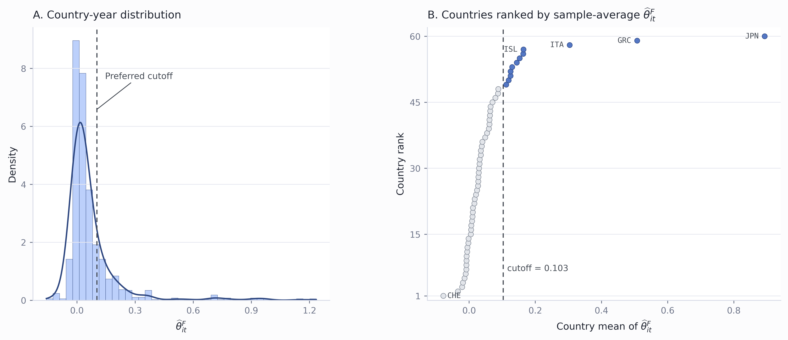
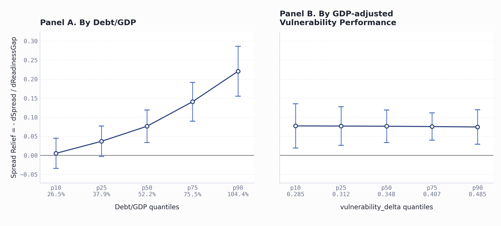
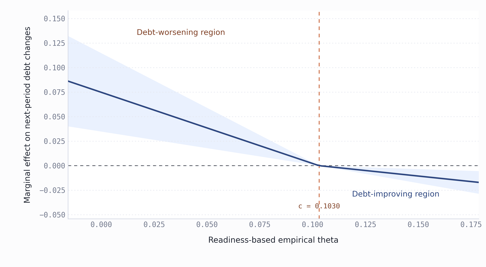

# Appendix C Standalone Report: `readiness100__vulnerability100`

## 1. Reproduction Files

- Stata code: `appendixC/paperC_appendixC_readiness_vulnerability_1995_2023_tables.do`.
- Result directory: `appendixC/result`.
- Report generator: `appendixC/generate_appendixC_report.py`.
- Figure 1 generator: `appendixC/plot_figure1_theta_distribution.py`.
- Figure 2 generator: `appendixC/plot_figure2_spread_relief.py`.
- Figure 3 generator: `appendixC/plot_figure3_kink_curve.py`.
- This report: `appendixC/appendixC_readiness_vulnerability_report.md`.

Run from the project root:

```powershell
& 'C:\Environment_tools\Stata18\StataMP-64.exe' /e do 'appendixC\paperC_appendixC_readiness_vulnerability_1995_2023_tables.do' 'C:\Users\chenyu\Desktop\0606'
python appendixC\plot_figure1_theta_distribution.py
python appendixC\plot_figure2_spread_relief.py
python appendixC\plot_figure3_kink_curve.py
python appendixC\generate_appendixC_report.py
```

## 2. Data Preprocessing

Source panel: `cleaned_imf_like_panel_1995_2023.csv`.

The standalone script fixes the empirical proxy pair as:

$$G_{it}=0.01\times readiness100_{it},\qquad X_{it}=0.01\times vulnerability100_{it}.$$

Other transformed variables are:

$$s_{it}=0.01\times bond\_spreads_{it},\quad B_{it}=0.01\times debt\_gdp_{it}.$$

The control vector is

$$\mathbf{Z}_{it}=\{lnrgdp, growth, inflation\_cpi, OB\_gdp, reserves, gee, rqe, tt\},$$

and every control in `Z` is also multiplied by 0.01 before estimation. The script builds

$$G_{it} \times B_{it},\quad G_{it} \times X_{it},\quad G_{it} \times \mathbf{Z}_{it}.$$

All regressions exclude the United States, use the 1995--2023 panel, include country and year fixed effects unless stated otherwise, and report robust t-statistics.

## 3. Regression Formulas

### Table 2 Baseline Spread Model

$$s_{it}=\alpha_i+\tau_t+\beta_GG_{it}+\beta_BB_{it}+\beta_XX_{it}+\boldsymbol{\Gamma}'\mathbf{Z}_{it}+u_{it}.$$

### Table 3 Heterogeneity and Full-Interaction Spread Models

Debt heterogeneity:

$$s_{it}=\alpha_i+\tau_t+\beta_GG_{it}+\beta_BB_{it}+\beta_XX_{it}+\beta_{GB}(G_{it} \times B_{it})+\boldsymbol{\Gamma}'\mathbf{Z}_{it}+u_{it}.$$

Climate-risk heterogeneity:

$$s_{it}=\alpha_i+\tau_t+\beta_GG_{it}+\beta_BB_{it}+\beta_XX_{it}+\beta_{GX}(G_{it} \times X_{it})+\boldsymbol{\Gamma}'\mathbf{Z}_{it}+u_{it}.$$

Full Table 3 interaction:

$$s_{it}=\alpha_i+\tau_t+\beta_GG_{it}+\beta_BB_{it}+\beta_XX_{it}+\beta_{GB}(G_{it} \times B_{it})+\beta_{GX}(G_{it} \times X_{it})+\boldsymbol{\Gamma}'\mathbf{Z}_{it}+u_{it}.$$

### Full-Interaction Empirical Theta

$$s_{it}=\alpha_i+\tau_t+\beta_GG_{it}+\beta_BB_{it}+\beta_{GB}(G_{it} \times B_{it})+\beta_{GX}(G_{it} \times X_{it})+\beta_XX_{it}+\boldsymbol{\Gamma}'\mathbf{Z}_{it}+\boldsymbol{\Gamma}_{GZ}'(G_{it} \times \mathbf{Z}_{it})+u_{it}.$$

$$\frac{\partial s_{it}}{\partial G_{it}}=\beta_G+\beta_{GB}B_{it}+\beta_{GX}X_{it}+\boldsymbol{\Gamma}_{GZ}'\mathbf{Z}_{it}.$$

$$\widehat{m}^{G,F}_{it}=-\frac{\partial \widehat{s}_{it}}{\partial G_{it}},\qquad \widehat{\theta}^{F}_{it}=B_{it}\widehat{m}^{G,F}_{it}.$$

### Debt-Change Models

Define next-period debt change as

$$\Delta B_{i,t+1}=B_{i,t+1}-B_{it}.$$

Baseline:

$$\Delta B_{i,t+1}=\alpha_i+\tau_t+\lambda_0G_{it}+\boldsymbol{\Gamma}'\mathbf{Z}_{it}+\varepsilon_{it}.$$

Continuous Full-theta:

$$\Delta B_{i,t+1}=\alpha_i+\tau_t+\lambda_0G_{it}+\lambda_1(G_{it} \times \widehat{\theta}^{F}_{it})+\boldsymbol{\Gamma}'\mathbf{Z}_{it}+\varepsilon_{it}.$$

Full-theta dynamics:

$$\Delta B_{i,t+1}=\alpha_i+\tau_t+\lambda_0G_{it}+\lambda_1(G_{it} \times \widehat{\theta}^{F}_{it})+\lambda_2\widehat{\theta}^{F}_{it}+\boldsymbol{\Gamma}'\mathbf{Z}_{it}+\varepsilon_{it}.$$

Grouped heterogeneity estimates the baseline debt-change equation within theta, debt-ratio, or marginal-relief quantile groups.

## 4. Main Tables

### Table 1. Post-Preprocessing Descriptive Statistics

Statistics use the post-preprocessing non-U.S. 1995--2023 panel. Each row is computed on nonmissing observations for that variable after the 0.01 scaling described in Section 2.

| Block | Variable | Symbol | Source | N | Mean | SD | Median | Min | Max |
| --- | ---: | ---: | ---: | ---: | ---: | ---: | ---: | ---: | ---: |
| S | Sovereign spread | $$s_{it}$$ | `0.01*bond_spreads` | 1272 | 0.024 | 0.043 | 0.007 | -0.034 | 0.343 |
| G | Readiness performance | $$G_{it}$$ | `0.01*readiness100` | 1798 | 0.496 | 0.143 | 0.492 | 0.179 | 0.807 |
| B | Debt/GDP | $$B_{it}$$ | `0.01*debt_gdp` | 1712 | 0.586 | 0.342 | 0.522 | 0.039 | 2.610 |
| X | Vulnerability performance | $$X_{it}$$ | `0.01*vulnerability100` | 1798 | 0.382 | 0.078 | 0.367 | 0.251 | 0.581 |
| Z | Real GDP | `Z: lnrgdp` | `0.01*lnrgdp` | 1791 | 0.080 | 0.029 | 0.077 | 0.019 | 0.163 |
| Z | Real GDP growth | `Z: growth` | `0.01*growth` | 1787 | 0.034 | 0.036 | 0.035 | -0.145 | 0.246 |
| Z | CPI inflation | `Z: inflation_cpi` | `0.01*inflation_cpi` | 1791 | 0.057 | 0.108 | 0.032 | -0.018 | 1.973 |
| Z | Overall balance/GDP | `Z: OB_gdp` | `0.01*OB_gdp` | 1697 | -0.004 | 0.034 | -0.005 | -0.300 | 0.234 |
| Z | International reserves | `Z: reserves` | `0.01*reserves` | 1753 | 0.055 | 0.128 | 0.018 | 0.000 | 1.527 |
| Z | Government effectiveness | `Z: gee` | `0.01*gee` | 1550 | 0.006 | 0.009 | 0.007 | -0.013 | 0.025 |
| Z | Regulatory quality | `Z: rqe` | `0.01*rqe` | 1550 | 0.006 | 0.008 | 0.007 | -0.013 | 0.023 |
| Z | Terms of trade | `Z: tt` | `0.01*tt` | 1595 | 1.006 | 0.187 | 0.994 | 0.319 | 2.731 |

### Table 2. Baseline Fixed-Effects Estimates

| Variable | Coefficient | t-stat. |
| --- | ---: | ---: |
| $$G_{it}$$ | -0.055*** | (-3.209) |
| $$B_{it}$$ | 0.045*** | (6.480) |
| $$X_{it}$$ | 0.005 | (0.073) |
| Controls | Yes |  |
| Country FE | Yes |  |
| Year FE | Yes |  |
| Sample period | 1995--2023 |  |
| Countries | 60 |  |
| Observations | 1,120 |  |
| Adjusted $$R^2$$ | 0.901 |  |

### Table 3. Heterogeneity and Full-Interaction Spread Models

| Variable | Debt heterogeneity | Climate-risk heterogeneity | Full interaction | Full interaction + $$G_{it} \times \mathbf{Z}_{it}$$ |
| --- | ---: | ---: | ---: | ---: |
| $$G_{it}$$ | 0.069*** | -0.062 | 0.063 | -0.166 |
| t-stat. | (3.233) | (-0.803) | (0.815) | (-1.498) |
| $$B_{it}$$ | 0.196*** | 0.045*** | 0.196*** | 0.186*** |
| t-stat. | (8.760) | (6.469) | (8.749) | (8.186) |
| $$X_{it}$$ | 0.074 | -0.002 | 0.068 | -0.257* |
| t-stat. | (1.067) | (-0.018) | (0.560) | (-1.936) |
| $$G_{it} \times B_{it}$$ | -0.276*** |  | -0.276*** | -0.261*** |
| t-stat. | (-7.734) |  | (-7.734) | (-7.192) |
| $$G_{it} \times X_{it}$$ |  | 0.016 | 0.014 | 0.835*** |
| t-stat. |  | (0.091) | (0.074) | (3.911) |
| Controls | Yes | Yes | Yes | Yes |
| $$G_{it} \times \mathbf{Z}_{it}$$ controls | No | No | No | Yes |
| Country FE | Yes | Yes | Yes | Yes |
| Year FE | Yes | Yes | Yes | Yes |
| Countries | 60 | 60 | 60 | 60 |
| Observations | 1,120 | 1,120 | 1,120 | 1,120 |
| Adjusted $$R^2$$ | 0.914 | 0.900 | 0.914 | 0.918 |

### Table 4. Theta Descriptive Statistics

| varname | N | mean | sd | median | min | max |
| --- | ---: | ---: | ---: | ---: | ---: | ---: |
| theta_hat_full | 1120 | .069990568 | .15302205 | .027890829 | -.15792002 | 1.2349477 |
| mG_hat_full | 1120 | .065373316 | .10806865 | .065386586 | -.38172647 | .53981829 |
| sg_G_hat_full | 1120 | -.065373316 | .10806865 | -.065386586 | -.53981829 | .38172647 |

### Figure 1. Distribution of `theta_hat_full`



Notes: The left panel plots the country-year distribution of $$\widehat{\theta}^{F}_{it}$$; the right panel ranks countries by sample-average $$\widehat{\theta}^{F}_{it}$$. The dashed vertical line marks the preferred cutoff from the kinked marginal-effect model without direct theta controls.

Construction details: Figure 1 is generated by `appendixC/plot_figure1_theta_distribution.py` from `theta_full_empirical_panel.csv`. The script keeps observations with `theta_sample_full == 1` and nonmissing `theta_hat_full`, which is the empirical theta implied by the full-interaction spread model. The left panel uses the retained country-year observations to draw a histogram and a kernel-density overlay for $$\widehat{\theta}^{F}_{it}$$. The right panel collapses the same sample to country-level averages, orders countries from lowest to highest average theta, and plots the resulting ranking. The vertical dashed cutoff is read from `table7_deltaB_kink_selected_cutoff_notheta.csv`, so the figure uses the preferred cutoff from the main without-theta-controls kink specification rather than a visually chosen threshold.

### Figure 2. Marginal Spread Relief from Table 3 Full Interaction



Notes: The figure plots the negative marginal effect of GDP-adjusted readiness performance on sovereign spreads, based on the Table 3 full-interaction specification. In Panel A, vulnerability_delta is fixed at its median. In Panel B, Debt/GDP is fixed at its median. Higher vulnerability_delta indicates lower vulnerability relative to GDP-predicted vulnerability; hence a downward slope in Panel B means stronger spread relief among more vulnerable countries.

Construction details: Figure 2 is generated in two steps. First, the Stata script re-estimates the Table 3 full-interaction spread model on the same sample used in Table 3: the United States is excluded, the 1995--2023 panel is used, all variables are scaled as in the report, the control vector $$\mathbf{Z}_{it}$$ is included, country and year fixed effects are included, and robust standard errors are used. From this regression, the script exports $$\widehat{\beta}_G$$, $$\widehat{\beta}_{GB}$$, $$\widehat{\beta}_{GX}$$ and their robust variance-covariance matrix. Panel A evaluates $$-\partial \widehat{s}_{it}/\partial G_{it}=-(\widehat{\beta}_G+\widehat{\beta}_{GB}B+\widehat{\beta}_{GX}X)$$ at the p10, p25, p50, p75, and p90 debt-ratio values, holding vulnerability performance at its sample median. Panel B evaluates the same expression at the p10, p25, p50, p75, and p90 vulnerability-performance values, holding debt/GDP at its sample median. For each plotted point, the standard error is computed by the delta method using the vector $$(1,B_q,X_{median})$$ in Panel A or $$(1,B_{median},X_q)$$ in Panel B. The plotted intervals are point estimates plus or minus 1.96 standard errors, and the two panels use a shared y-axis scale for direct comparison.

### Table 5. Country Screens Around the Preferred Cutoff

Screening thresholds use country-level means: preferred no-theta cutoff $$c=0.103037$$, mean debt/GDP median 53.06%, bottom-quartile $$\widehat{m}^{G,F}_{it}$$ 0.009303, and top-quartile $$\widehat{m}^{G,F}_{it}$$ 0.101899. The always-above and always-below conditions are evaluated year by year.

Low-debt countries with $$\widehat{\theta}^{F}_{it}$$ always above the cutoff and top-quartile marginal spread relief:

| Country | ISO3 | Sample period | Years | Mean debt/GDP | Mean theta | Min theta | Mean $$\widehat{m}^{G,F}_{it}$$ |
| --- | ---: | ---: | ---: | ---: | ---: | ---: | ---: |

High-debt countries with $$\widehat{\theta}^{F}_{it}$$ always below the cutoff and bottom-quartile marginal spread relief:

| Country | ISO3 | Sample period | Years | Mean debt/GDP | Mean theta | Max theta | Mean $$\widehat{m}^{G,F}_{it}$$ |
| --- | ---: | ---: | ---: | ---: | ---: | ---: | ---: |
| Croatia | HRV | 2008--2023 | 16 | 69.66% | -0.020914 | 0.009318 | -0.034212 |
| Malta | MLT | 2010--2023 | 14 | 53.91% | -0.013626 | 0.005246 | -0.028028 |
| Namibia | NAM | 2014--2023 | 10 | 53.74% | -0.007684 | 0.018498 | -0.026154 |
| Netherlands | NLD | 2000--2023 | 23 | 54.21% | -0.007387 | 0.013922 | -0.015870 |

### Table 6. Debt-Change Regressions

| row | baseline | continuous_z_controls | full_theta_dynamics |
| --- | ---: | ---: | ---: |
| G_it | -0.103*** | -0.082** | -0.090** |
| t-stat. | (-2.614) | (-2.074) | (-2.118) |
| G_it_x_theta_F_it |  | -0.277*** | 0.033 |
| t-stat. |  | (-3.619) | (0.057) |
| theta_F_it |  |  | -0.187 |
| t-stat. |  |  | (-0.520) |
| Real GDP | 8.171*** | 4.694*** | 4.523*** |
| t-stat. | (5.412) | (3.205) | (2.914) |
| Real GDP growth | -0.326*** | -0.369*** | -0.391*** |
| t-stat. | (-3.610) | (-4.180) | (-3.854) |
| CPI inflation | -0.166** | -0.166** | -0.161** |
| t-stat. | (-1.976) | (-2.027) | (-2.095) |
| Overall balance/GDP | -0.468*** | -0.448*** | -0.436*** |
| t-stat. | (-5.849) | (-5.572) | (-5.160) |
| International reserves | 0.020 | -0.007 | -0.005 |
| t-stat. | (1.465) | (-0.475) | (-0.350) |
| Government effectiveness | -1.913** | -1.174 | -1.111 |
| t-stat. | (-2.020) | (-1.222) | (-1.134) |
| Regulatory quality | 1.921** | 0.331 | -0.029 |
| t-stat. | (2.155) | (0.358) | (-0.025) |
| Terms of trade | 0.044*** | 0.035** | 0.036** |
| t-stat. | (2.774) | (2.355) | (2.500) |
| Theta main effect | No | No | Yes |
| Debt control | No | No | No |
| Controls | Yes | Yes | Yes |
| Country FE | Yes | Yes | Yes |
| Year FE | Yes | Yes | Yes |
| p(lambda0=0) | 0.009 | 0.038 | 0.034 |
| p(lambda1=0) |  | 0.000 | 0.954 |
| p(lambda2=0) |  |  | 0.603 |
| Observations | 1060 | 1060 | 1060 |
| Countries | 60 | 60 | 60 |
| Adjusted R2 | 0.425 | 0.443 | 0.444 |

### Table 7. Theta-Grouped Heterogeneity Regressions

| Group | Split | Cutoff low | Cutoff high | $$G_{it}$$ | t-stat. | p-value | N | Countries | Adj. $$R^2$$ |
| --- | ---: | ---: | ---: | ---: | ---: | ---: | ---: | ---: | ---: |
| Bottom 50% | 50 |  | 0.027 | -0.027 | -0.548 | 0.584 | 530 | 44 | 0.511 |
| Top 50% | 50 | 0.027 |  | -0.186** | -2.406 | 0.017 | 530 | 44 | 0.434 |
| 0-20% | 20 |  | -0.007 | 0.008 | 0.045 | 0.964 | 212 | 23 | 0.597 |
| 20-40% | 20 | -0.007 | 0.014 | -0.001 | -0.017 | 0.986 | 212 | 35 | 0.550 |
| 40-60% | 20 | 0.014 | 0.040 | -0.234*** | -2.803 | 0.006 | 212 | 41 | 0.412 |
| 60-80% | 20 | 0.040 | 0.100 | -0.133 | -1.139 | 0.256 | 212 | 38 | 0.489 |
| 80-100% | 20 | 0.100 |  | -0.417 | -1.622 | 0.107 | 212 | 24 | 0.576 |

### Table 8. Debt-Ratio Grouped Heterogeneity Regressions

| Group | Split | Cutoff low | Cutoff high | $$G_{it}$$ | t-stat. | p-value | N | Countries | Adj. $$R^2$$ |
| --- | ---: | ---: | ---: | ---: | ---: | ---: | ---: | ---: | ---: |
| 0-20% | B20 |  | 0.348 | 0.033 | 0.533 | 0.595 | 212 | 28 | 0.465 |
| 20-40% | B20 | 0.348 | 0.444 | -0.157 | -1.169 | 0.244 | 212 | 35 | 0.482 |
| 40-60% | B20 | 0.444 | 0.612 | -0.164** | -2.220 | 0.028 | 212 | 41 | 0.705 |
| 60-80% | B20 | 0.612 | 0.824 | -0.167 | -1.328 | 0.186 | 212 | 32 | 0.397 |
| 80-100% | B20 | 0.824 |  | -0.604** | -2.443 | 0.016 | 212 | 22 | 0.629 |

### Table 9. Marginal-Relief Grouped Heterogeneity Regressions

| Group | Split | Cutoff low | Cutoff high | $$G_{it}$$ | t-stat. | p-value | N | Countries | Adj. $$R^2$$ |
| --- | ---: | ---: | ---: | ---: | ---: | ---: | ---: | ---: | ---: |
| 0-20% | mG20 |  | -0.019 | 0.037 | 0.223 | 0.824 | 212 | 25 | 0.576 |
| 20-40% | mG20 | -0.019 | 0.038 | 0.045 | 0.598 | 0.551 | 212 | 34 | 0.610 |
| 40-60% | mG20 | 0.038 | 0.080 | -0.161* | -1.821 | 0.071 | 212 | 41 | 0.413 |
| 60-80% | mG20 | 0.080 | 0.126 | -0.316*** | -3.129 | 0.002 | 212 | 38 | 0.697 |
| 80-100% | mG20 | 0.126 |  | -0.434 | -1.426 | 0.156 | 212 | 27 | 0.588 |

### Table 10. Single-Crossing Kink Marginal-Effect Model

This is not a standard panel threshold model. The kink model directly estimates whether the marginal debt effect of readiness crosses zero at an empirical cutoff.

$$\Delta B_{i,t+1}=\alpha_i+\tau_t+aG_{it}(c-\widehat{\theta}^{F}_{it})_++bG_{it}(\widehat{\theta}^{F}_{it}-c)_++\boldsymbol{\Gamma}'\mathbf{Z}_{it}+\varepsilon_{it}.$$

$$m(\theta;c)=a(c-\theta)_+ + b(\theta-c)_+.$$

The theory-implied sign pattern is $$a>0$$ and $$b<0$$: adaptation raises next-period debt below the cutoff but reduces next-period debt above the cutoff.

This version keeps the two kinked readiness terms but omits $$\widehat{\theta}^{F}_{it}$$ and $$(\widehat{\theta}^{F}_{it}-c)_+$$ as direct controls.

| selection_rule | cutoff | rss | sign_ok | N_model | N_countries | share_low | share_high | b_low | se_low | t_low | p_low | p_low_positive | b_high | se_high | t_high | p_high | p_high_negative | r2 |
| --- | ---: | ---: | ---: | ---: | ---: | ---: | ---: | ---: | ---: | ---: | ---: | ---: | ---: | ---: | ---: | ---: | ---: | ---: |
| rss_min_cutoff | .1030368341448663 | 1.9117725 | 1 | 1060 | 60 | .81037736 | .18962264 | .72563851 | .19789192 | 3.6668422 | .00025893041 | .0001294652 | -.22545087 | .078013159 | -2.8899083 | .0039395764 | .0019697882 | .44665051 |
| sign_consistent_cutoff | .1030368341448663 | 1.9117725 | 1 | 1060 | 60 | .81037736 | .18962264 | .72563851 | .19789192 | 3.6668422 | .00025893041 | .0001294652 | -.22545087 | .078013159 | -2.8899083 | .0039395764 | .0019697882 | .44665051 |

| theta_quantile | theta_point | marginal_effect | standard_error | t_stat | p_value |
| --- | ---: | ---: | ---: | ---: | ---: |
| p10 | -.0157238078932075 | .086177297 | .023501772 | 3.6668422 | .00025893041 |
| p25 | -.0016207867994986 | .075943597 | .020710899 | 3.6668422 | .00025893041 |
| p50 | .0269418856364868 | .055217423 | .015058576 | 3.6668422 | .00025893041 |
| p75 | .0733605907577706 | .021534225 | .0058726892 | 3.6668422 | .00025893041 |
| p90 | .1785978739908932 | -.017035302 | .005894755 | -2.8899083 | .0039395764 |

##### Figure 3. Continuous Kink Marginal Effect without Theta Controls



Notes: The figure plots m(theta;c)=a(c-theta)_+ + b(theta-c)_+ from the single-crossing kink model without theta controls. Positive values imply that readiness improvements are associated with higher next-period debt changes; negative values imply lower next-period debt changes. The vertical dashed line marks the empirical cutoff c.

Construction details: Figure 3 is generated from the main without-theta-controls single-crossing kink model. The Stata script reads the preferred cutoff from `table7_deltaB_kink_selected_cutoff_notheta.csv`, constructs $$\Delta B_{i,t+1}=B_{i,t+1}-B_{it}$$, and estimates the kink regression with country fixed effects, year fixed effects, the same control vector $$\mathbf{Z}_{it}$$, and robust standard errors. The model includes only the two kinked readiness terms, $$G_{it}(c-\widehat{\theta}^{F}_{it})_+$$ and $$G_{it}(\widehat{\theta}^{F}_{it}-c)_+$$, and deliberately omits $$\widehat{\theta}^{F}_{it}$$ and $$(\widehat{\theta}^{F}_{it}-c)_+$$ as direct controls. It then takes the p10 and p90 of $$\widehat{\theta}^{F}_{it}$$ in the estimation sample and constructs 100 evenly spaced theta values between them. At each grid point, the plotted curve is $$m(\theta;c)=\widehat{a}(c-\theta)_+ + \widehat{b}(\theta-c)_+$$. The confidence band is computed by the delta method using the vector $$((c-\theta)_+, (\theta-c)_+)$$ and the robust 2-by-2 variance-covariance matrix of $$(\widehat{a},\widehat{b})$$. The horizontal dashed line marks zero marginal effect; the vertical dashed line marks the empirical cutoff. The left label identifies the region where the model predicts debt-worsening marginal effects, while the right label identifies the region where the model predicts debt-improving marginal effects.

Without theta controls: the segmented marginal-effect model identifies an empirical zero-crossing pattern. Below the cutoff, adaptation investment raises next-period debt; above the cutoff, adaptation investment reduces next-period debt. This supports the interpretation of $$\widehat{\theta}^{F}_{it}$$ as a debt-improving capacity index.

Robustness checks for the without-theta-controls version:

| Version | RSS cutoff | Sign OK | $$a$$ | $$p(a>0)$$ | $$b$$ | $$p(b<0)$$ | N | Adj. $$R^2$$ |
| --- | ---: | ---: | ---: | ---: | ---: | ---: | ---: | ---: |
| Main 10-90 | 0.103 | 1 | 0.726*** | 0.000 | -0.225*** | 0.002 | 1060 | 0.447 |
| Trim 15-85 | 0.103 | 1 | 0.726*** | 0.000 | -0.225*** | 0.002 | 1060 | 0.447 |
| Trim 20-80 | 0.100 | 1 | 0.734*** | 0.000 | -0.227*** | 0.002 | 1060 | 0.447 |
| Country cluster | 0.103 | 1 | 0.726*** | 0.001 | -0.225*** | 0.001 | 1060 | 0.447 |
| Lagged theta | 0.095 | 1 | 0.842*** | 0.000 | -0.241** | 0.005 | 970 | 0.457 |
| Horizon t+2 | 0.096 | 1 | 1.881*** | 0.000 | -0.468*** | 0.000 | 1000 | 0.508 |
| Horizon t+3 | 0.092 | 1 | 3.352*** | 0.000 | -0.745*** | 0.000 | 940 | 0.549 |

Full cutoff grids are exported as machine-readable CSV files and are not expanded inline: `table7_deltaB_kink_cutoff_grid*.csv`.

## 5. Appendix

### Table A1. Debt-Change Model Control-Set Variants

The appendix re-estimates the baseline, continuous full-theta, and full-theta dynamics debt-change models under three alternative control sets: $$\mathbf{Z}_{it}+B_{it}+X_{it}$$, $$B_{it}+X_{it}$$, and no controls. All variants keep country and year fixed effects and robust standard errors.

| Model | Control set | $$G_{it}$$ | $$G_{it}\times\widehat{\theta}^{F}_{it}$$ | $$\widehat{\theta}^{F}_{it}$$ | $$B_{it}$$ | $$X_{it}$$ | $$\mathbf{Z}_{it}$$ | N | Adj. $$R^2$$ |
| --- | ---: | ---: | ---: | ---: | ---: | ---: | ---: | ---: | ---: |
| Baseline | Z+B+X | -0.066 (-1.612) |  |  | -0.085*** (-3.514) | 0.323 (1.315) | Yes | 1060 | 0.450 |
| Baseline | B+X | -0.125*** (-2.898) |  |  | -0.084*** (-3.951) | -0.278 (-1.276) | No | 1060 | 0.362 |
| Baseline | None | -0.137*** (-3.145) |  |  |  |  | No | 1060 | 0.332 |
| Continuous Full-theta | Z+B+X | -0.068* (-1.664) | -0.100 (-0.905) |  | -0.065* (-1.808) | 0.343 (1.399) | Yes | 1060 | 0.450 |
| Continuous Full-theta | B+X | -0.133*** (-3.132) | -0.232** (-2.015) |  | -0.034 (-0.949) | -0.142 (-0.666) | No | 1060 | 0.369 |
| Continuous Full-theta | None | -0.139*** (-3.289) | -0.332*** (-4.858) |  |  |  | No | 1060 | 0.368 |
| Full-theta dynamics | Z+B+X | -0.069 (-1.646) | -0.075 (-0.131) | -0.016 (-0.047) | -0.064** (-2.199) | 0.339 (1.260) | Yes | 1060 | 0.450 |
| Full-theta dynamics | B+X | -0.141*** (-2.979) | -0.061 (-0.113) | -0.111 (-0.348) | -0.028 (-0.909) | -0.160 (-0.721) | No | 1060 | 0.368 |
| Full-theta dynamics | None | -0.150*** (-3.116) | -0.052 (-0.095) | -0.165 (-0.507) |  |  | No | 1060 | 0.368 |

### Table A2. Single-Crossing Kink without Theta Controls: Control-Set Variants

These appendix variants keep the main no-theta-controls kink structure but vary the additional controls. The preferred main-text cutoff remains the Z-controls without-theta-controls specification.

| Control set | RSS cutoff | Sign OK | $$a$$ | $$p(a>0)$$ | $$b$$ | $$p(b<0)$$ | N | Adj. $$R^2$$ |
| --- | ---: | ---: | ---: | ---: | ---: | ---: | ---: | ---: |
| Z+B+X | -0.002 | 1 | 1.078* | 0.050 | -0.118 | 0.147 | 1060 | 0.451 |
| B+X | 0.042 | 0 | -0.202 | 0.783 | -0.188 | 0.050 | 1060 | 0.366 |
| None | -0.016 | 1 | 0.141 | 0.240 | -0.339*** | 0.000 | 1060 | 0.364 |

### Table A3. Single-Crossing Kink with Theta Controls

This appendix version includes $$\widehat{\theta}^{F}_{it}$$ and $$(\widehat{\theta}^{F}_{it}-c)_+$$ as direct controls.

| selection_rule | cutoff | rss | sign_ok | N_model | N_countries | share_low | share_high | b_low | se_low | t_low | p_low | p_low_positive | b_high | se_high | t_high | p_high | p_high_negative | r2 |
| --- | ---: | ---: | ---: | ---: | ---: | ---: | ---: | ---: | ---: | ---: | ---: | ---: | ---: | ---: | ---: | ---: | ---: | ---: |
| rss_min_cutoff | .1788950476352001 | 1.8959068 | 0 | 1060 | 60 | .89999998 | .1 | .093421772 | .37260044 | .25072908 | .80207688 | .40103844 | .47005358 | .63086075 | .74509883 | .45639324 | .77180338 | .45010659 |
| sign_consistent_cutoff | -.0091057174425423 | 1.9175586 | 1 | 1060 | 60 | .17924528 | .82075471 | 2.0545886 | 2.8688293 | .71617669 | .47405535 | .23702767 | -.0002477103 | .56979406 | -.00043473652 | .99965322 | .49982661 | .44382665 |

| theta_quantile | theta_point | marginal_effect | standard_error | t_stat | p_value |
| --- | ---: | ---: | ---: | ---: | ---: |
| p10 | -.0157238078932075 | .018181639 | .07251507 | .25072908 | .80207688 |
| p25 | -.0016207867994986 | .01686411 | .06726028 | .25072908 | .80207688 |
| p50 | .0269418856364868 | .014195734 | .056617815 | .25072908 | .80207688 |
| p75 | .0733605907577706 | .0098592164 | .039322186 | .25072908 | .80207688 |
| p90 | .1785978739908932 | .000027762489 | .00011072704 | .25072908 | .80207688 |

With theta controls: the current data do not support the single-crossing segmented marginal-effect specification.

Robustness checks for the with-theta-controls version:

| Version | RSS cutoff | Sign OK | $$a$$ | $$p(a>0)$$ | $$b$$ | $$p(b<0)$$ | N | Adj. $$R^2$$ |
| --- | ---: | ---: | ---: | ---: | ---: | ---: | ---: | ---: |
| Main 10-90 | 0.179 | 0 | 0.093 | 0.401 | 0.470 | 0.772 | 1060 | 0.450 |
| Trim 15-85 | 0.111 | 0 | 0.530 | 0.149 | 0.418 | 0.744 | 1060 | 0.449 |
| Trim 20-80 | 0.100 | 0 | 0.633 | 0.116 | 0.394 | 0.733 | 1060 | 0.449 |
| Country cluster | 0.179 | 0 | 0.093 | 0.385 | 0.470 | 0.761 | 1060 | 0.450 |
| Lagged theta | 0.175 | 1 | 0.189 | 0.335 | -0.189 | 0.372 | 970 | 0.458 |
| Horizon t+2 | 0.174 | 0 | 0.042 | 0.469 | 0.245 | 0.600 | 1000 | 0.515 |
| Horizon t+3 | 0.170 | 0 | -0.086 | 0.556 | -0.968 | 0.124 | 940 | 0.558 |

### Table A4. Single-Crossing Kink with Theta Controls: Control-Set Variants

These appendix variants keep the direct theta controls and vary the additional controls across $$\mathbf{Z}_{it}+B_{it}+X_{it}$$, $$B_{it}+X_{it}$$, and no controls.

| Control set | RSS cutoff | Sign OK | $$a$$ | $$p(a>0)$$ | $$b$$ | $$p(b<0)$$ | N | Adj. $$R^2$$ |
| --- | ---: | ---: | ---: | ---: | ---: | ---: | ---: | ---: |
| Z+B+X | 0.044 | 0 | 1.614** | 0.020 | 0.141 | 0.593 | 1060 | 0.454 |
| B+X | 0.044 | 0 | 2.007*** | 0.004 | 0.234 | 0.660 | 1060 | 0.373 |
| None | 0.046 | 0 | 1.495** | 0.018 | 0.232 | 0.656 | 1060 | 0.367 |

## 6. Result File Inventory

Large machine-readable support files are saved in `appendixC/result` and are not expanded inline: `theta_full_empirical_panel.csv` and `table7_deltaB_kink_cutoff_grid*.csv`.

| File | Bytes | CSV rows |
| --- | ---: | ---: |
| appendix_debt_change_control_variants.csv | 2,074 | 9 |
| appendix_debt_change_control_variants.dta | 20,528 |  |
| figure1_country_theta_ranking.csv | 2,795 | 60 |
| figure1_theta_distribution_cutoff.pdf | 27,960 |  |
| figure1_theta_distribution_cutoff.png | 418,105 |  |
| figure1_theta_distribution_cutoff.svg | 48,354 |  |
| figure2.pdf | 26,667 |  |
| figure2.png | 186,425 |  |
| figure2_spread_relief_marginal_effects.csv | 1,065 | 10 |
| figure2_table3_fullinteraction_coefficients.csv | 308 | 3 |
| figure3_kink_marginal_effect_notheta_coefficients.csv | 253 | 2 |
| figure3_kink_marginal_effect_notheta_continuous.csv | 17,921 | 100 |
| figure3_kink_marginal_effect_notheta_continuous.dta | 18,675 |  |
| figure3_kink_marginal_effect_notheta_continuous.pdf | 19,026 |  |
| figure3_kink_marginal_effect_notheta_continuous.png | 180,010 |  |
| paperC_appendixC_readiness_vulnerability_1995_2023_tables.log | 2,205,344 |  |
| table1_preprocessed_descriptive_stats.csv | 1,265 | 12 |
| table1_preprocessed_descriptive_stats.dta | 9,211 |  |
| table1_preprocessed_descriptive_stats.tex | 1,520 |  |
| table2_baseline_fe_periods.tex | 877 |  |
| table3_heterogeneity_theta.tex | 1,305 |  |
| table6_2_6_3_7_debt_change_regressions.csv | 1,141 | 33 |
| table6_2_6_3_7_debt_change_regressions.tex | 2,259 |  |
| table6_2_debt_level_dynamics_regression.csv | 299 | 1 |
| table6_2_debt_level_dynamics_regression.dta | 10,219 |  |
| table6_fullinteraction_theta_regression.tex | 1,004 |  |
| table6_theta_descriptive_stats.csv | 254 | 3 |
| table6_theta_descriptive_stats.dta | 5,215 |  |
| table6_theta_descriptive_stats.tex | 817 |  |
| table7_0_baseline_debt_change_regression.csv | 113 | 1 |
| table7_0_baseline_debt_change_regression.dta | 5,067 |  |
| table7_B_group_heterogeneity.csv | 545 | 5 |
| table7_B_group_heterogeneity.dta | 7,975 |  |
| table7_B_group_heterogeneity.tex | 2,369 |  |
| table7_continuous_theta_debt_regression.csv | 309 | 1 |
| table7_continuous_theta_debt_regression.dta | 12,168 |  |
| table7_deltaB_kink_cutoff_grid.csv | 122,901 | 850 |
| table7_deltaB_kink_cutoff_grid.dta | 66,045 |  |
| table7_deltaB_kink_cutoff_grid_cluster.csv | 122,848 | 850 |
| table7_deltaB_kink_cutoff_grid_cluster.dta | 66,045 |  |
| table7_deltaB_kink_cutoff_grid_h2.csv | 114,119 | 802 |
| table7_deltaB_kink_cutoff_grid_h2.dta | 62,925 |  |
| table7_deltaB_kink_cutoff_grid_h3.csv | 109,119 | 754 |
| table7_deltaB_kink_cutoff_grid_h3.dta | 59,805 |  |
| table7_deltaB_kink_cutoff_grid_lagtheta.csv | 111,952 | 778 |
| table7_deltaB_kink_cutoff_grid_lagtheta.dta | 61,365 |  |
| table7_deltaB_kink_cutoff_grid_notheta.csv | 127,963 | 850 |
| table7_deltaB_kink_cutoff_grid_notheta.dta | 66,045 |  |
| table7_deltaB_kink_cutoff_grid_notheta_bx.csv | 125,047 | 850 |
| table7_deltaB_kink_cutoff_grid_notheta_bx.dta | 66,045 |  |
| table7_deltaB_kink_cutoff_grid_notheta_cluster.csv | 126,925 | 850 |
| table7_deltaB_kink_cutoff_grid_notheta_cluster.dta | 66,045 |  |
| table7_deltaB_kink_cutoff_grid_notheta_h2.csv | 119,725 | 802 |
| table7_deltaB_kink_cutoff_grid_notheta_h2.dta | 62,925 |  |
| table7_deltaB_kink_cutoff_grid_notheta_h3.csv | 114,561 | 754 |
| table7_deltaB_kink_cutoff_grid_notheta_h3.dta | 59,805 |  |
| table7_deltaB_kink_cutoff_grid_notheta_lagtheta.csv | 115,805 | 778 |
| table7_deltaB_kink_cutoff_grid_notheta_lagtheta.dta | 61,365 |  |
| table7_deltaB_kink_cutoff_grid_notheta_none.csv | 127,763 | 850 |
| table7_deltaB_kink_cutoff_grid_notheta_none.dta | 66,045 |  |
| table7_deltaB_kink_cutoff_grid_notheta_trim15.csv | 111,887 | 743 |
| table7_deltaB_kink_cutoff_grid_notheta_trim15.dta | 59,090 |  |
| table7_deltaB_kink_cutoff_grid_notheta_trim20.csv | 95,891 | 637 |
| table7_deltaB_kink_cutoff_grid_notheta_trim20.dta | 52,200 |  |
| table7_deltaB_kink_cutoff_grid_notheta_zbx.csv | 124,191 | 850 |
| table7_deltaB_kink_cutoff_grid_notheta_zbx.dta | 66,045 |  |
| table7_deltaB_kink_cutoff_grid_trim15.csv | 107,320 | 743 |
| table7_deltaB_kink_cutoff_grid_trim15.dta | 59,090 |  |
| table7_deltaB_kink_cutoff_grid_trim20.csv | 91,860 | 637 |
| table7_deltaB_kink_cutoff_grid_trim20.dta | 52,200 |  |
| table7_deltaB_kink_cutoff_grid_withtheta_bx.csv | 123,226 | 850 |
| table7_deltaB_kink_cutoff_grid_withtheta_bx.dta | 66,045 |  |
| table7_deltaB_kink_cutoff_grid_withtheta_none.csv | 122,963 | 850 |
| table7_deltaB_kink_cutoff_grid_withtheta_none.dta | 66,045 |  |
| table7_deltaB_kink_cutoff_grid_withtheta_zbx.csv | 123,519 | 850 |
| table7_deltaB_kink_cutoff_grid_withtheta_zbx.dta | 66,045 |  |
| table7_deltaB_kink_marginal_effects.csv | 404 | 5 |
| table7_deltaB_kink_marginal_effects.dta | 4,555 |  |
| table7_deltaB_kink_marginal_effects_cluster.csv | 407 | 5 |
| table7_deltaB_kink_marginal_effects_cluster.dta | 4,555 |  |
| table7_deltaB_kink_marginal_effects_h2.csv | 412 | 5 |
| table7_deltaB_kink_marginal_effects_h2.dta | 4,555 |  |
| table7_deltaB_kink_marginal_effects_h3.csv | 411 | 5 |
| table7_deltaB_kink_marginal_effects_h3.dta | 4,555 |  |
| table7_deltaB_kink_marginal_effects_lagtheta.csv | 399 | 5 |
| table7_deltaB_kink_marginal_effects_lagtheta.dta | 4,555 |  |
| table7_deltaB_kink_marginal_effects_notheta.csv | 418 | 5 |
| table7_deltaB_kink_marginal_effects_notheta.dta | 4,555 |  |
| table7_deltaB_kink_marginal_effects_notheta_bx.csv | 416 | 5 |
| table7_deltaB_kink_marginal_effects_notheta_bx.dta | 4,555 |  |
| table7_deltaB_kink_marginal_effects_notheta_cluster.csv | 414 | 5 |
| table7_deltaB_kink_marginal_effects_notheta_cluster.dta | 4,555 |  |
| table7_deltaB_kink_marginal_effects_notheta_h2.csv | 420 | 5 |
| table7_deltaB_kink_marginal_effects_notheta_h2.dta | 4,555 |  |
| table7_deltaB_kink_marginal_effects_notheta_h3.csv | 418 | 5 |
| table7_deltaB_kink_marginal_effects_notheta_h3.dta | 4,555 |  |
| table7_deltaB_kink_marginal_effects_notheta_lagtheta.csv | 413 | 5 |
| table7_deltaB_kink_marginal_effects_notheta_lagtheta.dta | 4,555 |  |
| table7_deltaB_kink_marginal_effects_notheta_none.csv | 440 | 5 |
| table7_deltaB_kink_marginal_effects_notheta_none.dta | 4,555 |  |
| table7_deltaB_kink_marginal_effects_notheta_trim15.csv | 418 | 5 |
| table7_deltaB_kink_marginal_effects_notheta_trim15.dta | 4,555 |  |
| table7_deltaB_kink_marginal_effects_notheta_trim20.csv | 415 | 5 |
| table7_deltaB_kink_marginal_effects_notheta_trim20.dta | 4,555 |  |
| table7_deltaB_kink_marginal_effects_notheta_zbx.csv | 418 | 5 |
| table7_deltaB_kink_marginal_effects_notheta_zbx.dta | 4,555 |  |
| table7_deltaB_kink_marginal_effects_trim15.csv | 397 | 5 |
| table7_deltaB_kink_marginal_effects_trim15.dta | 4,555 |  |
| table7_deltaB_kink_marginal_effects_trim20.csv | 397 | 5 |
| table7_deltaB_kink_marginal_effects_trim20.dta | 4,555 |  |
| table7_deltaB_kink_marginal_effects_withtheta_bx.csv | 407 | 5 |
| table7_deltaB_kink_marginal_effects_withtheta_bx.dta | 4,555 |  |
| table7_deltaB_kink_marginal_effects_withtheta_none.csv | 404 | 5 |
| table7_deltaB_kink_marginal_effects_withtheta_none.dta | 4,555 |  |
| table7_deltaB_kink_marginal_effects_withtheta_zbx.csv | 404 | 5 |
| table7_deltaB_kink_marginal_effects_withtheta_zbx.dta | 4,555 |  |
| table7_deltaB_kink_selected_cutoff.csv | 542 | 2 |
| table7_deltaB_kink_selected_cutoff.dta | 12,931 |  |
| table7_deltaB_kink_selected_cutoff_cluster.csv | 540 | 2 |
| table7_deltaB_kink_selected_cutoff_cluster.dta | 12,931 |  |
| table7_deltaB_kink_selected_cutoff_h2.csv | 541 | 2 |
| table7_deltaB_kink_selected_cutoff_h2.dta | 12,931 |  |
| table7_deltaB_kink_selected_cutoff_h3.csv | 538 | 2 |
| table7_deltaB_kink_selected_cutoff_h3.dta | 12,931 |  |
| table7_deltaB_kink_selected_cutoff_lagtheta.csv | 524 | 2 |
| table7_deltaB_kink_selected_cutoff_lagtheta.dta | 12,931 |  |
| table7_deltaB_kink_selected_cutoff_notheta.csv | 564 | 2 |
| table7_deltaB_kink_selected_cutoff_notheta.dta | 12,931 |  |
| table7_deltaB_kink_selected_cutoff_notheta_bx.csv | 542 | 2 |
| table7_deltaB_kink_selected_cutoff_notheta_bx.dta | 12,931 |  |
| table7_deltaB_kink_selected_cutoff_notheta_cluster.csv | 564 | 2 |
| table7_deltaB_kink_selected_cutoff_notheta_cluster.dta | 12,931 |  |
| table7_deltaB_kink_selected_cutoff_notheta_h2.csv | 564 | 2 |
| table7_deltaB_kink_selected_cutoff_notheta_h2.dta | 12,931 |  |
| table7_deltaB_kink_selected_cutoff_notheta_h3.csv | 574 | 2 |
| table7_deltaB_kink_selected_cutoff_notheta_h3.dta | 12,931 |  |
| table7_deltaB_kink_selected_cutoff_notheta_lagtheta.csv | 562 | 2 |
| table7_deltaB_kink_selected_cutoff_notheta_lagtheta.dta | 12,931 |  |
| table7_deltaB_kink_selected_cutoff_notheta_none.csv | 550 | 2 |
| table7_deltaB_kink_selected_cutoff_notheta_none.dta | 12,931 |  |
| table7_deltaB_kink_selected_cutoff_notheta_trim15.csv | 564 | 2 |
| table7_deltaB_kink_selected_cutoff_notheta_trim15.dta | 12,931 |  |
| table7_deltaB_kink_selected_cutoff_notheta_trim20.csv | 544 | 2 |
| table7_deltaB_kink_selected_cutoff_notheta_trim20.dta | 12,931 |  |
| table7_deltaB_kink_selected_cutoff_notheta_zbx.csv | 550 | 2 |
| table7_deltaB_kink_selected_cutoff_notheta_zbx.dta | 12,931 |  |
| table7_deltaB_kink_selected_cutoff_trim15.csv | 547 | 2 |
| table7_deltaB_kink_selected_cutoff_trim15.dta | 12,931 |  |
| table7_deltaB_kink_selected_cutoff_trim20.csv | 382 | 2 |
| table7_deltaB_kink_selected_cutoff_trim20.dta | 12,931 |  |
| table7_deltaB_kink_selected_cutoff_withtheta_bx.csv | 548 | 2 |
| table7_deltaB_kink_selected_cutoff_withtheta_bx.dta | 12,931 |  |
| table7_deltaB_kink_selected_cutoff_withtheta_none.csv | 547 | 2 |
| table7_deltaB_kink_selected_cutoff_withtheta_none.dta | 12,931 |  |
| table7_deltaB_kink_selected_cutoff_withtheta_zbx.csv | 546 | 2 |
| table7_deltaB_kink_selected_cutoff_withtheta_zbx.dta | 12,931 |  |
| table7_mG_group_heterogeneity.csv | 557 | 5 |
| table7_mG_group_heterogeneity.dta | 7,975 |  |
| table7_mG_group_heterogeneity.tex | 2,416 |  |
| table7_theta_group_heterogeneity.csv | 724 | 7 |
| table7_theta_group_heterogeneity.dta | 8,127 |  |
| table7_theta_group_heterogeneity.tex | 2,897 |  |
| theta_full_empirical_panel.csv | 915,791 | 1798 |
| theta_full_empirical_panel.dta | 470,644 |  |

## 7. Verification

- Stata runtime error count from `r(...)`: `0`.
- Stata completion marker found: `True`.
