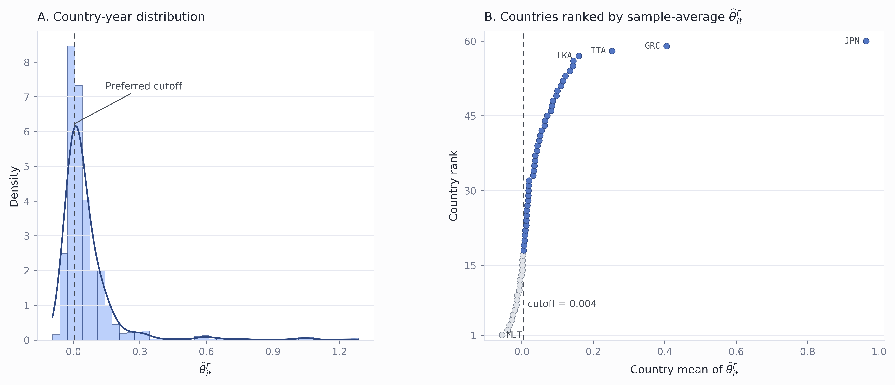
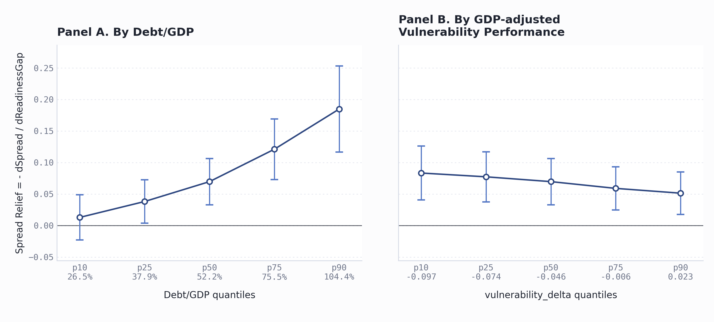
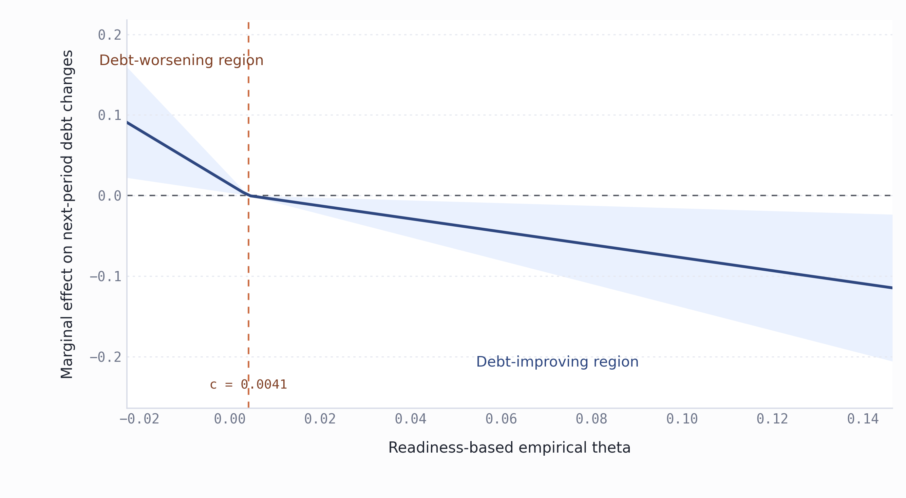

# Best2 Standalone Report: `readiness_delta100__vulnerability_delta100`

## 1. Reproduction Files

- Stata code: `best2/paperB_best2_readiness_delta_vulnerability_delta_1995_2023_tables.do`.
- Result directory: `best2/result`.
- Report generator: `best2/generate_best2_report.py`.
- Figure 1 generator: `best2/plot_figure1_theta_distribution.py`.
- Figure 2 generator: `best2/plot_figure2_spread_relief.py`.
- Figure 3 generator: `best2/plot_figure3_kink_curve.py`.
- This report: `best2/best2_readiness_delta_vulnerability_delta_report.md`.

Run from the project root:

```powershell
& 'C:\Environment_tools\Stata18\StataMP-64.exe' /e do 'best2\paperB_best2_readiness_delta_vulnerability_delta_1995_2023_tables.do' 'C:\Users\chenyu\Desktop\0606'
python best2\plot_figure1_theta_distribution.py
python best2\plot_figure2_spread_relief.py
python best2\plot_figure3_kink_curve.py
python best2\generate_best2_report.py
```

## 2. Data Preprocessing

Source panel: `cleaned_imf_like_panel_1995_2023.csv`.

The standalone script fixes the empirical proxy pair as:

$$G_{it}=0.01\times readiness\_delta100_{it},\qquad X_{it}=0.01\times vulnerability\_delta100_{it}.$$

Other transformed variables are:

$$s_{it}=0.01\times bond\_spreads_{it},\quad B_{it}=0.01\times debt\_gdp_{it}.$$

The control vector is

$$\mathbf{Z}_{it}=\{lnrgdp, growth, inflation\_cpi, OB\_gdp, reserves, gee, rqe, tt\},$$

and every control in `Z` is also multiplied by 0.01 before estimation. The script builds

$$G_{it} \times B_{it},\quad G_{it} \times X_{it},\quad G_{it} \times \mathbf{Z}_{it}.$$

All regressions exclude the United States, use the 1995--2023 panel, include country and year fixed effects unless stated otherwise, and report robust t-statistics.

## 3. Regression Formulas

### Table 2 Baseline Spread Model

$$s_{it}=\alpha_i+\tau_t+\beta_GG_{it}+\beta_BB_{it}+\beta_XX_{it}+\boldsymbol{\Gamma}'\mathbf{Z}_{it}+u_{it}.$$

### Table 3 Heterogeneity and Full-Interaction Spread Models

Debt heterogeneity:

$$s_{it}=\alpha_i+\tau_t+\beta_GG_{it}+\beta_BB_{it}+\beta_XX_{it}+\beta_{GB}(G_{it} \times B_{it})+\boldsymbol{\Gamma}'\mathbf{Z}_{it}+u_{it}.$$

Climate-risk heterogeneity:

$$s_{it}=\alpha_i+\tau_t+\beta_GG_{it}+\beta_BB_{it}+\beta_XX_{it}+\beta_{GX}(G_{it} \times X_{it})+\boldsymbol{\Gamma}'\mathbf{Z}_{it}+u_{it}.$$

Full Table 3 interaction:

$$s_{it}=\alpha_i+\tau_t+\beta_GG_{it}+\beta_BB_{it}+\beta_XX_{it}+\beta_{GB}(G_{it} \times B_{it})+\beta_{GX}(G_{it} \times X_{it})+\boldsymbol{\Gamma}'\mathbf{Z}_{it}+u_{it}.$$

### Full-Interaction Empirical Theta

$$s_{it}=\alpha_i+\tau_t+\beta_GG_{it}+\beta_BB_{it}+\beta_{GB}(G_{it} \times B_{it})+\beta_{GX}(G_{it} \times X_{it})+\beta_XX_{it}+\boldsymbol{\Gamma}'\mathbf{Z}_{it}+\boldsymbol{\Gamma}_{GZ}'(G_{it} \times \mathbf{Z}_{it})+u_{it}.$$

$$\frac{\partial s_{it}}{\partial G_{it}}=\beta_G+\beta_{GB}B_{it}+\beta_{GX}X_{it}+\boldsymbol{\Gamma}_{GZ}'\mathbf{Z}_{it}.$$

$$\widehat{m}^{G,F}_{it}=-\frac{\partial \widehat{s}_{it}}{\partial G_{it}},\qquad \widehat{\theta}^{F}_{it}=B_{it}\widehat{m}^{G,F}_{it}.$$

### Debt-Change Models

Define next-period debt change as

$$\Delta B_{i,t+1}=B_{i,t+1}-B_{it}.$$

Baseline:

$$\Delta B_{i,t+1}=\alpha_i+\tau_t+\lambda_0G_{it}+\boldsymbol{\Gamma}'\mathbf{Z}_{it}+\varepsilon_{it}.$$

Continuous Full-theta:

$$\Delta B_{i,t+1}=\alpha_i+\tau_t+\lambda_0G_{it}+\lambda_1(G_{it} \times \widehat{\theta}^{F}_{it})+\boldsymbol{\Gamma}'\mathbf{Z}_{it}+\varepsilon_{it}.$$

Full-theta dynamics:

$$\Delta B_{i,t+1}=\alpha_i+\tau_t+\lambda_0G_{it}+\lambda_1(G_{it} \times \widehat{\theta}^{F}_{it})+\lambda_2\widehat{\theta}^{F}_{it}+\boldsymbol{\Gamma}'\mathbf{Z}_{it}+\varepsilon_{it}.$$

Grouped heterogeneity estimates the baseline debt-change equation within theta, debt-ratio, or marginal-relief quantile groups.

## 4. Main Tables

### Table 1. Post-Preprocessing Descriptive Statistics

Statistics use the post-preprocessing non-U.S. 1995--2023 panel. Each row is computed on nonmissing observations for that variable after the 0.01 scaling described in Section 2.

| Block | Variable | Symbol | Source | N | Mean | SD | Median | Min | Max |
| --- | ---: | ---: | ---: | ---: | ---: | ---: | ---: | ---: | ---: |
| S | Sovereign spread | $$s_{it}$$ | `0.01*bond_spreads` | 1272 | 0.024 | 0.043 | 0.007 | -0.034 | 0.343 |
| G | Readiness performance | $$G_{it}$$ | `0.01*readiness_delta100` | 1798 | 0.058 | 0.089 | 0.048 | -0.326 | 0.303 |
| B | Debt/GDP | $$B_{it}$$ | `0.01*debt_gdp` | 1712 | 0.586 | 0.342 | 0.522 | 0.039 | 2.610 |
| X | Vulnerability performance | $$X_{it}$$ | `0.01*vulnerability_delta100` | 1798 | -0.040 | 0.058 | -0.047 | -0.185 | 0.295 |
| Z | Real GDP | `Z: lnrgdp` | `0.01*lnrgdp` | 1791 | 0.080 | 0.029 | 0.077 | 0.019 | 0.163 |
| Z | Real GDP growth | `Z: growth` | `0.01*growth` | 1787 | 0.034 | 0.036 | 0.035 | -0.145 | 0.246 |
| Z | CPI inflation | `Z: inflation_cpi` | `0.01*inflation_cpi` | 1791 | 0.057 | 0.108 | 0.032 | -0.018 | 1.973 |
| Z | Overall balance/GDP | `Z: OB_gdp` | `0.01*OB_gdp` | 1697 | -0.004 | 0.034 | -0.005 | -0.300 | 0.234 |
| Z | International reserves | `Z: reserves` | `0.01*reserves` | 1753 | 0.055 | 0.128 | 0.018 | 0.000 | 1.527 |
| Z | Government effectiveness | `Z: gee` | `0.01*gee` | 1550 | 0.006 | 0.009 | 0.007 | -0.013 | 0.025 |
| Z | Regulatory quality | `Z: rqe` | `0.01*rqe` | 1550 | 0.006 | 0.008 | 0.007 | -0.013 | 0.023 |
| Z | Terms of trade | `Z: tt` | `0.01*tt` | 1595 | 1.006 | 0.187 | 0.994 | 0.319 | 2.731 |

### Table 2. Baseline Fixed-Effects Estimates

| Variable | Coefficient | t-stat. |
| --- | ---: | ---: |
| $$G_{it}$$ | -0.046*** | (-2.804) |
| $$B_{it}$$ | 0.043*** | (6.042) |
| $$X_{it}$$ | -0.087*** | (-2.626) |
| Controls | Yes |  |
| Country FE | Yes |  |
| Year FE | Yes |  |
| Sample period | 1995--2023 |  |
| Countries | 60 |  |
| Observations | 1,120 |  |
| Adjusted $$R^2$$ | 0.900 |  |

### Table 3. Heterogeneity and Full-Interaction Spread Models

| Variable | Debt heterogeneity | Climate-risk heterogeneity | Full interaction | Full interaction + $$G_{it} \times \mathbf{Z}_{it}$$ |
| --- | ---: | ---: | ---: | ---: |
| $$G_{it}$$ | 0.053** | -0.046*** | 0.058** | 0.319*** |
| t-stat. | (2.116) | (-2.791) | (2.271) | (4.651) |
| $$B_{it}$$ | 0.062*** | 0.044*** | 0.064*** | 0.070*** |
| t-stat. | (6.922) | (6.056) | (6.995) | (7.456) |
| $$X_{it}$$ | -0.052 | -0.084** | -0.043 | 0.086* |
| t-stat. | (-1.562) | (-2.485) | (-1.244) | (1.900) |
| $$G_{it} \times B_{it}$$ | -0.211*** |  | -0.221*** | -0.266*** |
| t-stat. | (-4.795) |  | (-4.892) | (-5.723) |
| $$G_{it} \times X_{it}$$ |  | 0.121 | 0.268** | 0.339** |
| t-stat. |  | (1.196) | (2.302) | (2.255) |
| Controls | Yes | Yes | Yes | Yes |
| $$G_{it} \times \mathbf{Z}_{it}$$ controls | No | No | No | Yes |
| Country FE | Yes | Yes | Yes | Yes |
| Year FE | Yes | Yes | Yes | Yes |
| Countries | 60 | 60 | 60 | 60 |
| Observations | 1,120 | 1,120 | 1,120 | 1,120 |
| Adjusted $$R^2$$ | 0.905 | 0.900 | 0.906 | 0.911 |

### Table 4. Theta Descriptive Statistics

| varname | N | mean | sd | median | min | max |
| --- | ---: | ---: | ---: | ---: | ---: | ---: |
| theta_hat_full | 1120 | .062107649 | .15085071 | .020325547 | -.094017424 | 1.2851038 |
| mG_hat_full | 1120 | .056436218 | .10602468 | .044454418 | -.18407831 | .56174242 |
| sg_G_hat_full | 1120 | -.056436218 | .10602468 | -.044454418 | -.56174242 | .18407831 |

### Figure 1. Distribution of `theta_hat_full`



Notes: The left panel plots the country-year distribution of $$\widehat{\theta}^{F}_{it}$$; the right panel ranks countries by sample-average $$\widehat{\theta}^{F}_{it}$$. The dashed vertical line marks the preferred cutoff from the kinked marginal-effect model without direct theta controls.

Construction details: Figure 1 is generated by `best2/plot_figure1_theta_distribution.py` from `theta_full_empirical_panel.csv`. The script keeps observations with `theta_sample_full == 1` and nonmissing `theta_hat_full`, which is the empirical theta implied by the full-interaction spread model. The left panel uses the retained country-year observations to draw a histogram and a kernel-density overlay for $$\widehat{\theta}^{F}_{it}$$. The right panel collapses the same sample to country-level averages, orders countries from lowest to highest average theta, and plots the resulting ranking. The vertical dashed cutoff is read from `table7_deltaB_kink_selected_cutoff_notheta.csv`, so the figure uses the preferred cutoff from the main without-theta-controls kink specification rather than a visually chosen threshold.

### Figure 2. Marginal Spread Relief from Table 3 Full Interaction



Notes: The figure plots the negative marginal effect of GDP-adjusted readiness performance on sovereign spreads, based on the Table 3 full-interaction specification. In Panel A, vulnerability_delta is fixed at its median. In Panel B, Debt/GDP is fixed at its median. Higher vulnerability_delta indicates lower vulnerability relative to GDP-predicted vulnerability; hence a downward slope in Panel B means stronger spread relief among more vulnerable countries.

Construction details: Figure 2 is generated in two steps. First, the Stata script re-estimates the Table 3 full-interaction spread model on the same sample used in Table 3: the United States is excluded, the 1995--2023 panel is used, all variables are scaled as in the report, the control vector $$\mathbf{Z}_{it}$$ is included, country and year fixed effects are included, and robust standard errors are used. From this regression, the script exports $$\widehat{\beta}_G$$, $$\widehat{\beta}_{GB}$$, $$\widehat{\beta}_{GX}$$ and their robust variance-covariance matrix. Panel A evaluates $$-\partial \widehat{s}_{it}/\partial G_{it}=-(\widehat{\beta}_G+\widehat{\beta}_{GB}B+\widehat{\beta}_{GX}X)$$ at the p10, p25, p50, p75, and p90 debt-ratio values, holding vulnerability performance at its sample median. Panel B evaluates the same expression at the p10, p25, p50, p75, and p90 vulnerability-performance values, holding debt/GDP at its sample median. For each plotted point, the standard error is computed by the delta method using the vector $$(1,B_q,X_{median})$$ in Panel A or $$(1,B_{median},X_q)$$ in Panel B. The plotted intervals are point estimates plus or minus 1.96 standard errors, and the two panels use a shared y-axis scale for direct comparison.

### Table 5. Country Screens Around the Preferred Cutoff

Screening thresholds use country-level means: preferred no-theta cutoff $$c=0.004123$$, mean debt/GDP median 53.06%, bottom-quartile $$\widehat{m}^{G,F}_{it}$$ 0.003202, and top-quartile $$\widehat{m}^{G,F}_{it}$$ 0.112256. The always-above and always-below conditions are evaluated year by year.

Low-debt countries with $$\widehat{\theta}^{F}_{it}$$ always above the cutoff and top-quartile marginal spread relief:

| Country | ISO3 | Sample period | Years | Mean debt/GDP | Mean theta | Min theta | Mean $$\widehat{m}^{G,F}_{it}$$ |
| --- | ---: | ---: | ---: | ---: | ---: | ---: | ---: |
| Vietnam | VNM | 2007--2023 | 17 | 39.50% | 0.065026 | 0.041981 | 0.163972 |
| Indonesia | IDN | 2003--2023 | 21 | 33.72% | 0.055437 | 0.025187 | 0.155856 |
| Colombia | COL | 2002--2023 | 21 | 45.82% | 0.063998 | 0.036972 | 0.134476 |

High-debt countries with $$\widehat{\theta}^{F}_{it}$$ always below the cutoff and bottom-quartile marginal spread relief:

| Country | ISO3 | Sample period | Years | Mean debt/GDP | Mean theta | Max theta | Mean $$\widehat{m}^{G,F}_{it}$$ |
| --- | ---: | ---: | ---: | ---: | ---: | ---: | ---: |
| Malta | MLT | 2010--2023 | 14 | 53.91% | -0.054937 | -0.034221 | -0.106807 |

### Table 6. Debt-Change Regressions

| row | baseline | continuous_z_controls | full_theta_dynamics |
| --- | ---: | ---: | ---: |
| G_it | -0.073 | -0.042 | -0.015 |
| t-stat. | (-1.463) | (-0.810) | (-0.302) |
| G_it_x_theta_F_it |  | -0.886*** | -0.310 |
| t-stat. |  | (-2.707) | (-0.660) |
| theta_F_it |  |  | -0.141* |
| t-stat. |  |  | (-1.898) |
| Real GDP | 8.143*** | 7.869*** | 5.352*** |
| t-stat. | (5.436) | (5.370) | (2.977) |
| Real GDP growth | -0.342*** | -0.346*** | -0.392*** |
| t-stat. | (-3.715) | (-3.796) | (-4.179) |
| CPI inflation | -0.173** | -0.174** | -0.158** |
| t-stat. | (-2.053) | (-2.060) | (-2.070) |
| Overall balance/GDP | -0.480*** | -0.458*** | -0.416*** |
| t-stat. | (-6.090) | (-5.862) | (-5.204) |
| International reserves | 0.018 | 0.020 | 0.019 |
| t-stat. | (1.299) | (1.456) | (1.366) |
| Government effectiveness | -1.777* | -1.396 | -0.601 |
| t-stat. | (-1.895) | (-1.470) | (-0.575) |
| Regulatory quality | 1.637* | 0.815 | -0.405 |
| t-stat. | (1.857) | (0.907) | (-0.404) |
| Terms of trade | 0.044*** | 0.037** | 0.037*** |
| t-stat. | (2.845) | (2.484) | (2.584) |
| Theta main effect | No | No | Yes |
| Debt control | No | No | No |
| Controls | Yes | Yes | Yes |
| Country FE | Yes | Yes | Yes |
| Year FE | Yes | Yes | Yes |
| p(lambda0=0) | 0.144 | 0.418 | 0.763 |
| p(lambda1=0) |  | 0.007 | 0.510 |
| p(lambda2=0) |  |  | 0.058 |
| Observations | 1060 | 1060 | 1060 |
| Countries | 60 | 60 | 60 |
| Adjusted R2 | 0.425 | 0.433 | 0.441 |

### Table 7. Theta-Grouped Heterogeneity Regressions

| Group | Split | Cutoff low | Cutoff high | $$G_{it}$$ | t-stat. | p-value | N | Countries | Adj. $$R^2$$ |
| --- | ---: | ---: | ---: | ---: | ---: | ---: | ---: | ---: | ---: |
| Bottom 50% | 50 |  | 0.019 | 0.082 | 1.552 | 0.121 | 530 | 45 | 0.553 |
| Top 50% | 50 | 0.019 |  | -0.265*** | -3.159 | 0.002 | 530 | 47 | 0.403 |
| 0-20% | 20 |  | -0.008 | 0.243* | 1.727 | 0.086 | 212 | 25 | 0.604 |
| 20-40% | 20 | -0.008 | 0.009 | 0.057 | 0.866 | 0.388 | 212 | 33 | 0.669 |
| 40-60% | 20 | 0.009 | 0.036 | -0.152 | -1.550 | 0.123 | 212 | 35 | 0.499 |
| 60-80% | 20 | 0.036 | 0.093 | -0.249* | -1.770 | 0.079 | 212 | 37 | 0.366 |
| 80-100% | 20 | 0.093 |  | -0.372** | -2.077 | 0.039 | 212 | 22 | 0.522 |

### Table 8. Debt-Ratio Grouped Heterogeneity Regressions

| Group | Split | Cutoff low | Cutoff high | $$G_{it}$$ | t-stat. | p-value | N | Countries | Adj. $$R^2$$ |
| --- | ---: | ---: | ---: | ---: | ---: | ---: | ---: | ---: | ---: |
| 0-20% | B20 |  | 0.348 | 0.060 | 0.861 | 0.390 | 212 | 28 | 0.466 |
| 20-40% | B20 | 0.348 | 0.444 | -0.116 | -1.336 | 0.184 | 212 | 35 | 0.483 |
| 40-60% | B20 | 0.444 | 0.612 | -0.067 | -1.021 | 0.309 | 212 | 41 | 0.700 |
| 60-80% | B20 | 0.612 | 0.824 | 0.038 | 0.291 | 0.771 | 212 | 32 | 0.394 |
| 80-100% | B20 | 0.824 |  | -0.363 | -1.317 | 0.190 | 212 | 22 | 0.625 |

### Table 9. Marginal-Relief Grouped Heterogeneity Regressions

| Group | Split | Cutoff low | Cutoff high | $$G_{it}$$ | t-stat. | p-value | N | Countries | Adj. $$R^2$$ |
| --- | ---: | ---: | ---: | ---: | ---: | ---: | ---: | ---: | ---: |
| 0-20% | mG20 |  | -0.020 | 0.325** | 2.244 | 0.026 | 212 | 25 | 0.603 |
| 20-40% | mG20 | -0.020 | 0.022 | 0.097 | 0.732 | 0.465 | 212 | 36 | 0.568 |
| 40-60% | mG20 | 0.022 | 0.070 | -0.041 | -0.426 | 0.671 | 212 | 36 | 0.518 |
| 60-80% | mG20 | 0.070 | 0.129 | -0.134 | -1.350 | 0.179 | 212 | 34 | 0.606 |
| 80-100% | mG20 | 0.129 |  | -0.512*** | -3.273 | 0.001 | 212 | 24 | 0.493 |

### Table 10. Single-Crossing Kink Marginal-Effect Model

This is not a standard panel threshold model. The kink model directly estimates whether the marginal debt effect of readiness crosses zero at an empirical cutoff.

$$\Delta B_{i,t+1}=\alpha_i+\tau_t+aG_{it}(c-\widehat{\theta}^{F}_{it})_++bG_{it}(\widehat{\theta}^{F}_{it}-c)_++\boldsymbol{\Gamma}'\mathbf{Z}_{it}+\varepsilon_{it}.$$

$$m(\theta;c)=a(c-\theta)_+ + b(\theta-c)_+.$$

The theory-implied sign pattern is $$a>0$$ and $$b<0$$: adaptation raises next-period debt below the cutoff but reduces next-period debt above the cutoff.

This version keeps the two kinked readiness terms but omits $$\widehat{\theta}^{F}_{it}$$ and $$(\widehat{\theta}^{F}_{it}-c)_+$$ as direct controls.

| selection_rule | cutoff | rss | sign_ok | N_model | N_countries | share_low | share_high | b_low | se_low | t_low | p_low | p_low_positive | b_high | se_high | t_high | p_high | p_high_negative | r2 |
| --- | ---: | ---: | ---: | ---: | ---: | ---: | ---: | ---: | ---: | ---: | ---: | ---: | ---: | ---: | ---: | ---: | ---: | ---: |
| rss_min_cutoff | .0041231435658208 | 1.9513826 | 1 | 1060 | 60 | .34999999 | .64999998 | 3.3802719 | 1.3043393 | 2.5915587 | .0096980724 | .0048490362 | -.80435956 | .32646343 | -2.4638581 | .013917975 | .0069589876 | .43518561 |
| sign_consistent_cutoff | .0041231435658208 | 1.9513826 | 1 | 1060 | 60 | .34999999 | .64999998 | 3.3802719 | 1.3043393 | 2.5915587 | .0096980724 | .0048490362 | -.80435956 | .32646343 | -2.4638581 | .013917975 | .0069589876 | .43518561 |

| theta_quantile | theta_point | marginal_effect | standard_error | t_stat | p_value |
| --- | ---: | ---: | ---: | ---: | ---: |
| p10 | -.0227554245416531 | .090856865 | .03505877 | 2.5915587 | .0096980724 |
| p25 | -.0035084268143534 | .025796782 | .0099541573 | 2.5915587 | .0096980724 |
| p50 | .01935791671065 | -.012254235 | .004973596 | -2.4638581 | .013917975 |
| p75 | .0719141070189072 | -.054528311 | .02213127 | -2.4638581 | .013917975 |
| p90 | .1465406566170752 | -.11455489 | .046494108 | -2.4638581 | .013917975 |

##### Figure 3. Continuous Kink Marginal Effect without Theta Controls



Notes: The figure plots m(theta;c)=a(c-theta)_+ + b(theta-c)_+ from the single-crossing kink model without theta controls. Positive values imply that readiness improvements are associated with higher next-period debt changes; negative values imply lower next-period debt changes. The vertical dashed line marks the empirical cutoff c.

Construction details: Figure 3 is generated from the main without-theta-controls single-crossing kink model. The Stata script reads the preferred cutoff from `table7_deltaB_kink_selected_cutoff_notheta.csv`, constructs $$\Delta B_{i,t+1}=B_{i,t+1}-B_{it}$$, and estimates the kink regression with country fixed effects, year fixed effects, the same control vector $$\mathbf{Z}_{it}$$, and robust standard errors. The model includes only the two kinked readiness terms, $$G_{it}(c-\widehat{\theta}^{F}_{it})_+$$ and $$G_{it}(\widehat{\theta}^{F}_{it}-c)_+$$, and deliberately omits $$\widehat{\theta}^{F}_{it}$$ and $$(\widehat{\theta}^{F}_{it}-c)_+$$ as direct controls. It then takes the p10 and p90 of $$\widehat{\theta}^{F}_{it}$$ in the estimation sample and constructs 100 evenly spaced theta values between them. At each grid point, the plotted curve is $$m(\theta;c)=\widehat{a}(c-\theta)_+ + \widehat{b}(\theta-c)_+$$. The confidence band is computed by the delta method using the vector $$((c-\theta)_+, (\theta-c)_+)$$ and the robust 2-by-2 variance-covariance matrix of $$(\widehat{a},\widehat{b})$$. The horizontal dashed line marks zero marginal effect; the vertical dashed line marks the empirical cutoff. The left label identifies the region where the model predicts debt-worsening marginal effects, while the right label identifies the region where the model predicts debt-improving marginal effects.

Without theta controls: the segmented marginal-effect model identifies an empirical zero-crossing pattern. Below the cutoff, adaptation investment raises next-period debt; above the cutoff, adaptation investment reduces next-period debt. This supports the interpretation of $$\widehat{\theta}^{F}_{it}$$ as a debt-improving capacity index.

Robustness checks for the without-theta-controls version:

| Version | RSS cutoff | Sign OK | $$a$$ | $$p(a>0)$$ | $$b$$ | $$p(b<0)$$ | N | Adj. $$R^2$$ |
| --- | ---: | ---: | ---: | ---: | ---: | ---: | ---: | ---: |
| Main 10-90 | 0.004 | 1 | 3.380*** | 0.005 | -0.804** | 0.007 | 1060 | 0.435 |
| Trim 15-85 | 0.004 | 1 | 3.380*** | 0.005 | -0.804** | 0.007 | 1060 | 0.435 |
| Trim 20-80 | 0.004 | 1 | 3.380*** | 0.005 | -0.804** | 0.007 | 1060 | 0.435 |
| Country cluster | 0.004 | 1 | 3.380*** | 0.000 | -0.804** | 0.007 | 1060 | 0.435 |
| Lagged theta | 0.005 | 1 | 3.405** | 0.016 | -1.033*** | 0.002 | 970 | 0.445 |
| Horizon t+2 | 0.006 | 1 | 7.888*** | 0.001 | -1.962*** | 0.000 | 1000 | 0.486 |
| Horizon t+3 | 0.007 | 1 | 15.799*** | 0.000 | -3.341*** | 0.000 | 940 | 0.517 |

Full cutoff grids are exported as machine-readable CSV files and are not expanded inline: `table7_deltaB_kink_cutoff_grid*.csv`.

## 5. Appendix

### Table A1. Debt-Change Model Control-Set Variants

The appendix re-estimates the baseline, continuous full-theta, and full-theta dynamics debt-change models under three alternative control sets: $$\mathbf{Z}_{it}+B_{it}+X_{it}$$, $$B_{it}+X_{it}$$, and no controls. All variants keep country and year fixed effects and robust standard errors.

| Model | Control set | $$G_{it}$$ | $$G_{it}\times\widehat{\theta}^{F}_{it}$$ | $$\widehat{\theta}^{F}_{it}$$ | $$B_{it}$$ | $$X_{it}$$ | $$\mathbf{Z}_{it}$$ | N | Adj. $$R^2$$ |
| --- | ---: | ---: | ---: | ---: | ---: | ---: | ---: | ---: | ---: |
| Baseline | Z+B+X | -0.024 (-0.569) |  |  | -0.093*** (-3.839) | -0.143 (-1.241) | Yes | 1060 | 0.449 |
| Baseline | B+X | -0.069 (-1.513) |  |  | -0.098*** (-4.607) | -0.492*** (-4.306) | No | 1060 | 0.372 |
| Baseline | None | -0.030 (-0.577) |  |  |  |  | No | 1060 | 0.327 |
| Continuous Full-theta | Z+B+X | -0.016 (-0.370) | -0.250 (-0.576) |  | -0.086*** (-2.675) | -0.118 (-0.974) | Yes | 1060 | 0.449 |
| Continuous Full-theta | B+X | -0.056 (-1.166) | -0.432 (-1.009) |  | -0.087*** (-3.183) | -0.457*** (-3.981) | No | 1060 | 0.373 |
| Continuous Full-theta | None | 0.010 (0.182) | -1.236*** (-3.504) |  |  |  | No | 1060 | 0.346 |
| Full-theta dynamics | Z+B+X | -0.021 (-0.473) | -0.133 (-0.267) | -0.044 (-0.584) | -0.076** (-2.369) | -0.146 (-1.088) | Yes | 1060 | 0.449 |
| Full-theta dynamics | B+X | -0.077 (-1.615) | 0.062 (0.138) | -0.188*** (-2.727) | -0.035 (-1.130) | -0.538*** (-4.311) | No | 1060 | 0.383 |
| Full-theta dynamics | None | 0.038 (0.728) | -0.302 (-0.674) | -0.194*** (-3.320) |  |  | No | 1060 | 0.367 |

### Table A2. Single-Crossing Kink without Theta Controls: Control-Set Variants

These appendix variants keep the main no-theta-controls kink structure but vary the additional controls. The preferred main-text cutoff remains the Z-controls without-theta-controls specification.

| Control set | RSS cutoff | Sign OK | $$a$$ | $$p(a>0)$$ | $$b$$ | $$p(b<0)$$ | N | Adj. $$R^2$$ |
| --- | ---: | ---: | ---: | ---: | ---: | ---: | ---: | ---: |
| Z+B+X | 0.004 | 1 | 3.402** | 0.010 | -0.154 | 0.360 | 1060 | 0.452 |
| B+X | -0.003 | 1 | 3.583 | 0.052 | -0.345 | 0.205 | 1060 | 0.375 |
| None | 0.006 | 1 | 4.343** | 0.005 | -1.061*** | 0.001 | 1060 | 0.351 |

### Table A3. Single-Crossing Kink with Theta Controls

This appendix version includes $$\widehat{\theta}^{F}_{it}$$ and $$(\widehat{\theta}^{F}_{it}-c)_+$$ as direct controls.

| selection_rule | cutoff | rss | sign_ok | N_model | N_countries | share_low | share_high | b_low | se_low | t_low | p_low | p_low_positive | b_high | se_high | t_high | p_high | p_high_negative | r2 |
| --- | ---: | ---: | ---: | ---: | ---: | ---: | ---: | ---: | ---: | ---: | ---: | ---: | ---: | ---: | ---: | ---: | ---: | ---: |
| rss_min_cutoff | .0041231435658208 | 1.888585 | 1 | 1060 | 60 | .34999999 | .64999998 | 3.5598772 | 1.1253495 | 3.1633523 | .0016083405 | .00080417027 | -.11308923 | .48639572 | -.23250458 | .81619537 | .40809768 | .45223022 |
| sign_consistent_cutoff | .0041231435658208 | 1.888585 | 1 | 1060 | 60 | .34999999 | .64999998 | 3.5598772 | 1.1253495 | 3.1633523 | .0016083405 | .00080417027 | -.11308923 | .48639572 | -.23250458 | .81619537 | .40809768 | .45223022 |

| theta_quantile | theta_point | marginal_effect | standard_error | t_stat | p_value |
| --- | ---: | ---: | ---: | ---: | ---: |
| p10 | -.0227554245416531 | .095684402 | .030247785 | 3.1633523 | .0016083405 |
| p25 | -.0035084268143534 | .027167452 | .0085881846 | 3.1633523 | .0016083405 |
| p50 | .01935791671065 | -.0017228888 | .0074101286 | -.23250458 | .81619537 |
| p75 | .0719141070189072 | -.0076664281 | .032973234 | -.23250458 | .81619537 |
| p90 | .1465406566170752 | -.016105887 | .069271266 | -.23250458 | .81619537 |

With theta controls: the evidence supports a debt-worsening effect of adaptation in the low-theta region, but the debt-improving effect in the high-theta region is weaker.

Robustness checks for the with-theta-controls version:

| Version | RSS cutoff | Sign OK | $$a$$ | $$p(a>0)$$ | $$b$$ | $$p(b<0)$$ | N | Adj. $$R^2$$ |
| --- | ---: | ---: | ---: | ---: | ---: | ---: | ---: | ---: |
| Main 10-90 | 0.004 | 1 | 3.560*** | 0.001 | -0.113 | 0.408 | 1060 | 0.452 |
| Trim 15-85 | 0.004 | 1 | 3.560*** | 0.001 | -0.113 | 0.408 | 1060 | 0.452 |
| Trim 20-80 | 0.004 | 1 | 3.560*** | 0.001 | -0.113 | 0.408 | 1060 | 0.452 |
| Country cluster | 0.004 | 1 | 3.560*** | 0.002 | -0.113 | 0.397 | 1060 | 0.452 |
| Lagged theta | 0.125 | 1 | 0.675** | 0.024 | -0.275 | 0.327 | 970 | 0.456 |
| Horizon t+2 | 0.008 | 1 | 6.990*** | 0.000 | -0.875 | 0.142 | 1000 | 0.509 |
| Horizon t+3 | 0.133 | 1 | 2.174** | 0.006 | -1.700* | 0.040 | 940 | 0.547 |

### Table A4. Single-Crossing Kink with Theta Controls: Control-Set Variants

These appendix variants keep the direct theta controls and vary the additional controls across $$\mathbf{Z}_{it}+B_{it}+X_{it}$$, $$B_{it}+X_{it}$$, and no controls.

| Control set | RSS cutoff | Sign OK | $$a$$ | $$p(a>0)$$ | $$b$$ | $$p(b<0)$$ | N | Adj. $$R^2$$ |
| --- | ---: | ---: | ---: | ---: | ---: | ---: | ---: | ---: |
| Z+B+X | -0.012 | 1 | 3.303* | 0.044 | -0.101 | 0.416 | 1060 | 0.456 |
| B+X | -0.004 | 0 | 2.576 | 0.075 | 0.018 | 0.516 | 1060 | 0.401 |
| None | -0.004 | 1 | 5.873*** | 0.000 | -0.020 | 0.482 | 1060 | 0.387 |

## 6. Result File Inventory

Large machine-readable support files are saved in `best2/result` and are not expanded inline: `theta_full_empirical_panel.csv` and `table7_deltaB_kink_cutoff_grid*.csv`.

| File | Bytes | CSV rows |
| --- | ---: | ---: |
| appendix_debt_change_control_variants.csv | 2,077 | 9 |
| appendix_debt_change_control_variants.dta | 20,528 |  |
| figure1_country_theta_ranking.csv | 2,768 | 60 |
| figure1_theta_distribution_cutoff.pdf | 29,729 |  |
| figure1_theta_distribution_cutoff.png | 486,924 |  |
| figure1_theta_distribution_cutoff.svg | 52,301 |  |
| figure2.pdf | 31,361 |  |
| figure2.png | 349,275 |  |
| figure2_spread_relief_marginal_effects.csv | 1,083 | 10 |
| figure2_table3_fullinteraction_coefficients.csv | 308 | 3 |
| figure3_kink_marginal_effect_notheta_coefficients.csv | 253 | 2 |
| figure3_kink_marginal_effect_notheta_continuous.csv | 18,070 | 100 |
| figure3_kink_marginal_effect_notheta_continuous.dta | 18,675 |  |
| figure3_kink_marginal_effect_notheta_continuous.pdf | 30,954 |  |
| figure3_kink_marginal_effect_notheta_continuous.png | 301,696 |  |
| paperB_best2_readiness_delta_vulnerability_delta_1995_2023_tables.log | 2,186,450 |  |
| table1_preprocessed_descriptive_stats.csv | 1,287 | 12 |
| table1_preprocessed_descriptive_stats.dta | 9,211 |  |
| table1_preprocessed_descriptive_stats.tex | 1,524 |  |
| table2_baseline_fe_periods.tex | 882 |  |
| table3_heterogeneity_theta.tex | 1,317 |  |
| table6_2_6_3_7_debt_change_regressions.csv | 1,132 | 33 |
| table6_2_6_3_7_debt_change_regressions.tex | 2,250 |  |
| table6_2_debt_level_dynamics_regression.csv | 299 | 1 |
| table6_2_debt_level_dynamics_regression.dta | 10,219 |  |
| table6_fullinteraction_theta_regression.tex | 1,002 |  |
| table6_theta_descriptive_stats.csv | 255 | 3 |
| table6_theta_descriptive_stats.dta | 5,215 |  |
| table6_theta_descriptive_stats.tex | 817 |  |
| table7_0_baseline_debt_change_regression.csv | 110 | 1 |
| table7_0_baseline_debt_change_regression.dta | 5,067 |  |
| table7_B_group_heterogeneity.csv | 545 | 5 |
| table7_B_group_heterogeneity.dta | 7,975 |  |
| table7_B_group_heterogeneity.tex | 2,368 |  |
| table7_continuous_theta_debt_regression.csv | 304 | 1 |
| table7_continuous_theta_debt_regression.dta | 12,168 |  |
| table7_deltaB_kink_cutoff_grid.csv | 124,180 | 849 |
| table7_deltaB_kink_cutoff_grid.dta | 65,980 |  |
| table7_deltaB_kink_cutoff_grid_cluster.csv | 123,926 | 849 |
| table7_deltaB_kink_cutoff_grid_cluster.dta | 65,980 |  |
| table7_deltaB_kink_cutoff_grid_h2.csv | 115,396 | 802 |
| table7_deltaB_kink_cutoff_grid_h2.dta | 62,925 |  |
| table7_deltaB_kink_cutoff_grid_h3.csv | 110,543 | 753 |
| table7_deltaB_kink_cutoff_grid_h3.dta | 59,740 |  |
| table7_deltaB_kink_cutoff_grid_lagtheta.csv | 113,090 | 778 |
| table7_deltaB_kink_cutoff_grid_lagtheta.dta | 61,365 |  |
| table7_deltaB_kink_cutoff_grid_notheta.csv | 125,026 | 849 |
| table7_deltaB_kink_cutoff_grid_notheta.dta | 65,980 |  |
| table7_deltaB_kink_cutoff_grid_notheta_bx.csv | 123,338 | 849 |
| table7_deltaB_kink_cutoff_grid_notheta_bx.dta | 65,980 |  |
| table7_deltaB_kink_cutoff_grid_notheta_cluster.csv | 125,607 | 849 |
| table7_deltaB_kink_cutoff_grid_notheta_cluster.dta | 65,980 |  |
| table7_deltaB_kink_cutoff_grid_notheta_h2.csv | 117,237 | 802 |
| table7_deltaB_kink_cutoff_grid_notheta_h2.dta | 62,925 |  |
| table7_deltaB_kink_cutoff_grid_notheta_h3.csv | 113,768 | 753 |
| table7_deltaB_kink_cutoff_grid_notheta_h3.dta | 59,740 |  |
| table7_deltaB_kink_cutoff_grid_notheta_lagtheta.csv | 113,754 | 778 |
| table7_deltaB_kink_cutoff_grid_notheta_lagtheta.dta | 61,365 |  |
| table7_deltaB_kink_cutoff_grid_notheta_none.csv | 125,837 | 849 |
| table7_deltaB_kink_cutoff_grid_notheta_none.dta | 65,980 |  |
| table7_deltaB_kink_cutoff_grid_notheta_trim15.csv | 109,638 | 744 |
| table7_deltaB_kink_cutoff_grid_notheta_trim15.dta | 59,155 |  |
| table7_deltaB_kink_cutoff_grid_notheta_trim20.csv | 93,930 | 637 |
| table7_deltaB_kink_cutoff_grid_notheta_trim20.dta | 52,200 |  |
| table7_deltaB_kink_cutoff_grid_notheta_zbx.csv | 123,860 | 849 |
| table7_deltaB_kink_cutoff_grid_notheta_zbx.dta | 65,980 |  |
| table7_deltaB_kink_cutoff_grid_trim15.csv | 108,934 | 744 |
| table7_deltaB_kink_cutoff_grid_trim15.dta | 59,155 |  |
| table7_deltaB_kink_cutoff_grid_trim20.csv | 93,335 | 637 |
| table7_deltaB_kink_cutoff_grid_trim20.dta | 52,200 |  |
| table7_deltaB_kink_cutoff_grid_withtheta_bx.csv | 122,262 | 849 |
| table7_deltaB_kink_cutoff_grid_withtheta_bx.dta | 65,980 |  |
| table7_deltaB_kink_cutoff_grid_withtheta_none.csv | 124,437 | 849 |
| table7_deltaB_kink_cutoff_grid_withtheta_none.dta | 65,980 |  |
| table7_deltaB_kink_cutoff_grid_withtheta_zbx.csv | 123,399 | 849 |
| table7_deltaB_kink_cutoff_grid_withtheta_zbx.dta | 65,980 |  |
| table7_deltaB_kink_marginal_effects.csv | 413 | 5 |
| table7_deltaB_kink_marginal_effects.dta | 4,555 |  |
| table7_deltaB_kink_marginal_effects_cluster.csv | 410 | 5 |
| table7_deltaB_kink_marginal_effects_cluster.dta | 4,555 |  |
| table7_deltaB_kink_marginal_effects_h2.csv | 412 | 5 |
| table7_deltaB_kink_marginal_effects_h2.dta | 4,555 |  |
| table7_deltaB_kink_marginal_effects_h3.csv | 399 | 5 |
| table7_deltaB_kink_marginal_effects_h3.dta | 4,555 |  |
| table7_deltaB_kink_marginal_effects_lagtheta.csv | 404 | 5 |
| table7_deltaB_kink_marginal_effects_lagtheta.dta | 4,555 |  |
| table7_deltaB_kink_marginal_effects_notheta.csv | 410 | 5 |
| table7_deltaB_kink_marginal_effects_notheta.dta | 4,555 |  |
| table7_deltaB_kink_marginal_effects_notheta_bx.csv | 410 | 5 |
| table7_deltaB_kink_marginal_effects_notheta_bx.dta | 4,555 |  |
| table7_deltaB_kink_marginal_effects_notheta_cluster.csv | 412 | 5 |
| table7_deltaB_kink_marginal_effects_notheta_cluster.dta | 4,555 |  |
| table7_deltaB_kink_marginal_effects_notheta_h2.csv | 414 | 5 |
| table7_deltaB_kink_marginal_effects_notheta_h2.dta | 4,555 |  |
| table7_deltaB_kink_marginal_effects_notheta_h3.csv | 420 | 5 |
| table7_deltaB_kink_marginal_effects_notheta_h3.dta | 4,555 |  |
| table7_deltaB_kink_marginal_effects_notheta_lagtheta.csv | 410 | 5 |
| table7_deltaB_kink_marginal_effects_notheta_lagtheta.dta | 4,555 |  |
| table7_deltaB_kink_marginal_effects_notheta_none.csv | 410 | 5 |
| table7_deltaB_kink_marginal_effects_notheta_none.dta | 4,555 |  |
| table7_deltaB_kink_marginal_effects_notheta_trim15.csv | 410 | 5 |
| table7_deltaB_kink_marginal_effects_notheta_trim15.dta | 4,555 |  |
| table7_deltaB_kink_marginal_effects_notheta_trim20.csv | 410 | 5 |
| table7_deltaB_kink_marginal_effects_notheta_trim20.dta | 4,555 |  |
| table7_deltaB_kink_marginal_effects_notheta_zbx.csv | 408 | 5 |
| table7_deltaB_kink_marginal_effects_notheta_zbx.dta | 4,555 |  |
| table7_deltaB_kink_marginal_effects_trim15.csv | 413 | 5 |
| table7_deltaB_kink_marginal_effects_trim15.dta | 4,555 |  |
| table7_deltaB_kink_marginal_effects_trim20.csv | 413 | 5 |
| table7_deltaB_kink_marginal_effects_trim20.dta | 4,555 |  |
| table7_deltaB_kink_marginal_effects_withtheta_bx.csv | 411 | 5 |
| table7_deltaB_kink_marginal_effects_withtheta_bx.dta | 4,555 |  |
| table7_deltaB_kink_marginal_effects_withtheta_none.csv | 417 | 5 |
| table7_deltaB_kink_marginal_effects_withtheta_none.dta | 4,555 |  |
| table7_deltaB_kink_marginal_effects_withtheta_zbx.csv | 411 | 5 |
| table7_deltaB_kink_marginal_effects_withtheta_zbx.dta | 4,555 |  |
| table7_deltaB_kink_selected_cutoff.csv | 552 | 2 |
| table7_deltaB_kink_selected_cutoff.dta | 12,931 |  |
| table7_deltaB_kink_selected_cutoff_cluster.csv | 548 | 2 |
| table7_deltaB_kink_selected_cutoff_cluster.dta | 12,931 |  |
| table7_deltaB_kink_selected_cutoff_h2.csv | 556 | 2 |
| table7_deltaB_kink_selected_cutoff_h2.dta | 12,931 |  |
| table7_deltaB_kink_selected_cutoff_h3.csv | 550 | 2 |
| table7_deltaB_kink_selected_cutoff_h3.dta | 12,931 |  |
| table7_deltaB_kink_selected_cutoff_lagtheta.csv | 542 | 2 |
| table7_deltaB_kink_selected_cutoff_lagtheta.dta | 12,931 |  |
| table7_deltaB_kink_selected_cutoff_notheta.csv | 558 | 2 |
| table7_deltaB_kink_selected_cutoff_notheta.dta | 12,931 |  |
| table7_deltaB_kink_selected_cutoff_notheta_bx.csv | 548 | 2 |
| table7_deltaB_kink_selected_cutoff_notheta_bx.dta | 12,931 |  |
| table7_deltaB_kink_selected_cutoff_notheta_cluster.csv | 560 | 2 |
| table7_deltaB_kink_selected_cutoff_notheta_cluster.dta | 12,931 |  |
| table7_deltaB_kink_selected_cutoff_notheta_h2.csv | 564 | 2 |
| table7_deltaB_kink_selected_cutoff_notheta_h2.dta | 12,931 |  |
| table7_deltaB_kink_selected_cutoff_notheta_h3.csv | 572 | 2 |
| table7_deltaB_kink_selected_cutoff_notheta_h3.dta | 12,931 |  |
| table7_deltaB_kink_selected_cutoff_notheta_lagtheta.csv | 552 | 2 |
| table7_deltaB_kink_selected_cutoff_notheta_lagtheta.dta | 12,931 |  |
| table7_deltaB_kink_selected_cutoff_notheta_none.csv | 552 | 2 |
| table7_deltaB_kink_selected_cutoff_notheta_none.dta | 12,931 |  |
| table7_deltaB_kink_selected_cutoff_notheta_trim15.csv | 558 | 2 |
| table7_deltaB_kink_selected_cutoff_notheta_trim15.dta | 12,931 |  |
| table7_deltaB_kink_selected_cutoff_notheta_trim20.csv | 558 | 2 |
| table7_deltaB_kink_selected_cutoff_notheta_trim20.dta | 12,931 |  |
| table7_deltaB_kink_selected_cutoff_notheta_zbx.csv | 548 | 2 |
| table7_deltaB_kink_selected_cutoff_notheta_zbx.dta | 12,931 |  |
| table7_deltaB_kink_selected_cutoff_trim15.csv | 552 | 2 |
| table7_deltaB_kink_selected_cutoff_trim15.dta | 12,931 |  |
| table7_deltaB_kink_selected_cutoff_trim20.csv | 552 | 2 |
| table7_deltaB_kink_selected_cutoff_trim20.dta | 12,931 |  |
| table7_deltaB_kink_selected_cutoff_withtheta_bx.csv | 553 | 2 |
| table7_deltaB_kink_selected_cutoff_withtheta_bx.dta | 12,931 |  |
| table7_deltaB_kink_selected_cutoff_withtheta_none.csv | 558 | 2 |
| table7_deltaB_kink_selected_cutoff_withtheta_none.dta | 12,931 |  |
| table7_deltaB_kink_selected_cutoff_withtheta_zbx.csv | 548 | 2 |
| table7_deltaB_kink_selected_cutoff_withtheta_zbx.dta | 12,931 |  |
| table7_mG_group_heterogeneity.csv | 555 | 5 |
| table7_mG_group_heterogeneity.dta | 7,975 |  |
| table7_mG_group_heterogeneity.tex | 2,421 |  |
| table7_theta_group_heterogeneity.csv | 724 | 7 |
| table7_theta_group_heterogeneity.dta | 8,127 |  |
| table7_theta_group_heterogeneity.tex | 2,916 |  |
| theta_full_empirical_panel.csv | 922,140 | 1798 |
| theta_full_empirical_panel.dta | 470,644 |  |

## 7. Verification

- Stata runtime error count from `r(...)`: `0`.
- Stata completion marker found: `True`.
